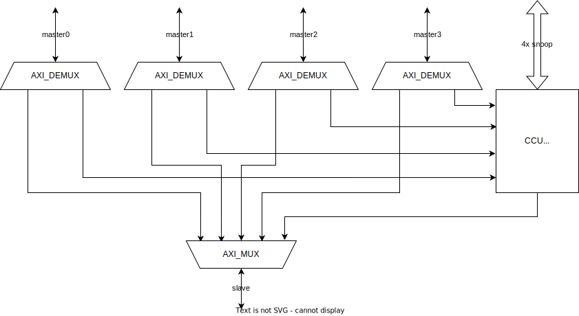
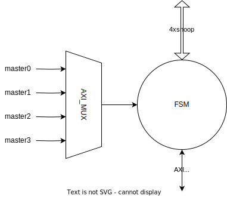
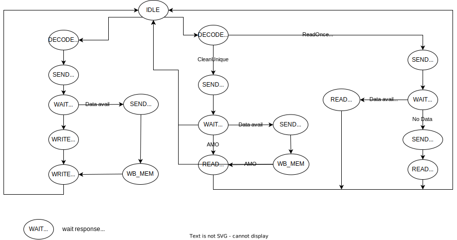

# ACE_CCU_TOP

The coherence control unit (CCU) implements the ACE interconnector functions, which broadcasts the snooping transactions to all the cache controllers and forwards the AXI transactions to a single the AXI master.
The number of ACE slave ports is configurable, but it doesn't scale well beyond 8.

The CCU consists of three main components:

- AXI DEMUX
- AXI MUX
- CCU logic

The AXI DEMUX is responsible for routing the incoming request from a master, with the route dependent on the transaction type. For shareable and cacheable types the incoming request is routed to CCU logic whereas all other type of transactions are routed directly to RAM via AXI MUX. The CCU logic component is responsible for maintaining the data coherency protocol. It communicates with the cache controllers to enforce the cache coherence protocol, ensuring that all caches have consistent copies of shared data. The CCU logic component handles data sharing and synchronization, guaranteeing the integrity of shared data in multiprocessor systems. The implementation details of CCU logic are given below.

The AXI DEMUX and AXI MUX components are sourced from [PULP platform](https://github.com/pulp-platform/axi/).

## CCU logic

The CCU Logic is responsible for translating the AXI requests into snoop requests. CCU logic is further composed of two main components: the AXI MUX and the CCU FSM as shown in diagram below. This AXI MUX, which has been extended to support the ACE protocol. It serializes incoming requests to the CCU from multiple AXI masters. Each request received by the AXI MUX is then passed to the CCU FSM (Finite State Machine) for further processing. The CCU FSM is responsible for managing the data coherence and sharing process. It controls the flow of requests and orchestrates the necessary actions to ensure data coherency among the caches using snoop ports. In case of data unavailability or invalidated dirty cache line, it forwards the request to memory using AXI port. 

The CCU FSM implements the state transitions and control logic for handling read and write transactions in the coherence control unit. The breakdown of the different states and their corresponding functionality is as follows:

- IDLE:
  - Waits for incoming valid AXI requests from the master.
  - Determines the transaction type (read or write) and transitions to the respective state.
  - Sets initiator flags so that snoop requests are not sent to the initiating master (to avoid deadlock) .

- DECODE_R:
  - Checks the read transaction type.
  - If it's not a CleanUnique request, transitions to SEND_READ otherwise, transitions to SEND_INVALID_R.

- DECODE_W:
  - Transitions to SEND_INVALID_W.

- SEND_INVALID_R/W:
  - Sends snoop CleanInvalid requests to all the snooping masters i.e., cache controller
    - Asserts ac_valid for all snoop masters except initiating master  and wait for them to de-assert ac_ready indicating that they have received a CleanInvalid request.
  - Transitions to WAIT_INVALID_R/W once all snoop masters are ready.

- WAIT_INVALID_R:
  - Waits for all snoop masters to send snoop response with CR valid.
  - If data is available and dirty, transitions to SEND_AXI_REQ_WRITE_BACK_R/W otherwise, transitions to SEND_ACK_I_R.

- WAIT_INVALID_W:
  - Waits for all snoop masters to send snoop response with CR valid.
  - If data is available and dirty, transitions to SEND_AXI_REQ_WRITE_BACK_W otherwise, transitions to SEND_AXI_REQ_W.

- SEND_AXI_REQ_WRITE_BACK_R/W
  - Initiates an AXI write transaction (AW) to write back the dirty data in main memory.
  - Transitions to WRITE_BACK_MEM_R/W once aw_ready is asserted.

- WRITE_BACK_MEM_R:
  - Sends dirty data via W channel of AXI to main memory
  - Transitions to SEND_ACK_I_R once data is written and b_valid is asserted by the main memory.

- WRITE_BACK_MEM_W:
  - Sends dirty data via W channel of AXI to main memory
  - Transitions to SEND_AXI_REQ_W once data is written and b_valid is asserted by the main memory.

- SEND_ACK_I_R:
  - Indicates to the initiating master that clean invalid operation is completed by sending r_valid
  - Transitions back to IDLE once r_ready is asserted.

- SEND_READ:
  - Sends snoop ReadX requests to all the snooping masters
    - Asserts ac_valid for all snoop masters except initiating master  and wait for them to de-assert ac_ready indicating that they have received a ReadX request.
  - Transitions to WAIT_RESP_R once all snoop masters have received the request.

- WAIT_RESP_R:
  - Waits for all snoop masters to send snoop response with CR valid.
  - If data is available and there are no response errors, transitions to READ_SNP_DATA. Otherwise, transitions to SEND_AXI_REQ_R.

- READ_SNP_DATA:
  - Waits for data to be available and checks for end-of-transmission conditions ( entire cache line is read i.e., 2 CD beats are received).
  - Transitions to IDLE once the end-of-transmission conditions are met.

- SEND_AXI_REQ_R:
  - Sends data read request to main memory via AXI MUX and waits for the responding slave to assert ar_ready.
  - Transitions to READ_MEM once ar_ready is asserted.

- READ_MEM:
  - Waits for the main memory to send back the data in R channel.
  - upon receiving the last data transitions to IDLE state.

- SEND_AXI_REQ_W:
  - Initiates an AXI write transaction (AW) to write back the incoming data from initiating master to the main memory.
  - Transitions to WRITE_MEM once aw_ready is asserted.

- WRITE_MEM:
  - Sends incoming data via W channel of AXI to main memory
  - Once data is written and b_valid is asserted by the main memory:
    - In case of ATOP, state transitions to READ_MEM to receive an extra R beat
    - otherwise state transitions to IDLE

## Known limitations and possible improvements

- Serialization of the incoming transactions: it would in theory be possible to process multiple non-conflicting transactions in parallel. This would require the instantiation of multiple ccu\_logic modules and the logic to avoid them to target the same cacheline at the same time. It would also require the CPUs' cache controllers to be able to handle multiple requests at the same time. This would probably move the bottleneck from the CCU to the cache, which should be able to process an higher number of requests in parallel.

- Serialization of the read operations towards the caches and shared memory: in the current implementation, a read to the shared memory is done only after failing to read a cacheline from another CPU. This situation could be improved by making the two requests in parallel: the new scenario has the drawback of increasing the traffic on the AXI port and of adding a sometimes unnecessary latency to the read transactions which hit data on a CPU's cache; the response to the initiator should be sent as soon as there's a valid data being transferred over the snoop port, and the response from the AXI should be discarded.

- Serialization of the writeback in case of invalidation: in the current implementation, in case of CleanInvalid operations, the CCU takes care of the writeback of the dirty cachelines and terminates the transaction only once this is done. The writeback is necessary because otherwise, in case of 2 CPU invalidating each other's cacheline, the system can end up in a situation where the latest data get lost. Performance could be improved by decoupling the writeback from the termination of the transaction, so that the transaction can be finished without waiting for the writeback to be complete. By profiling the Splash-3 benchmarks it has been noticed that the time spent in executing CleanUnique/ReadUnique operations is a negligible fraction of the whole time, so this operation would bring limited benefits.